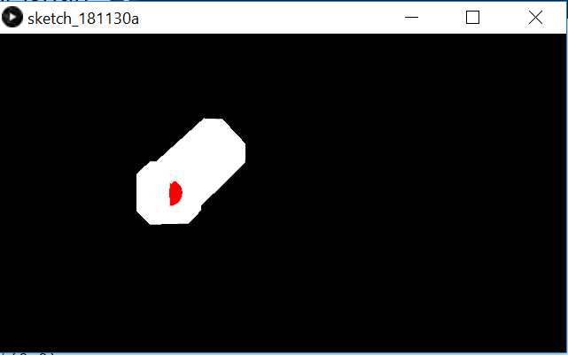
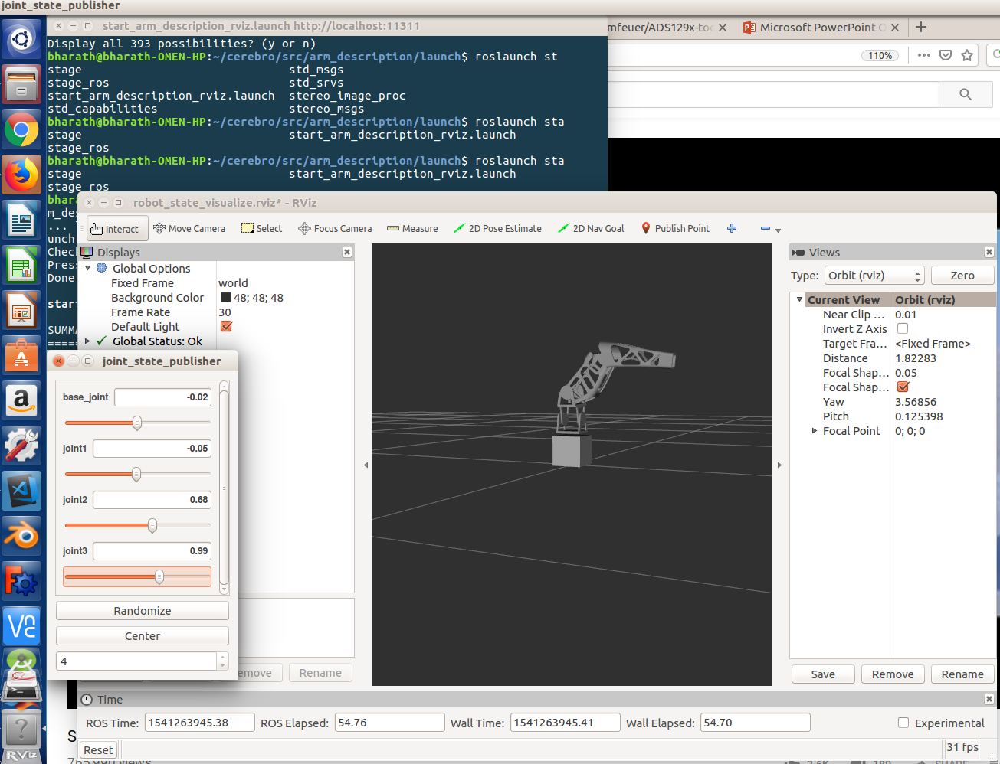
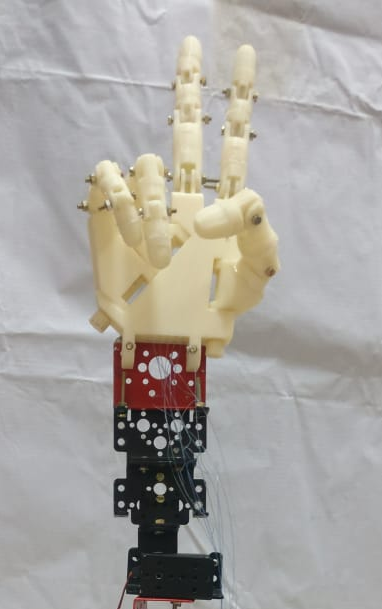
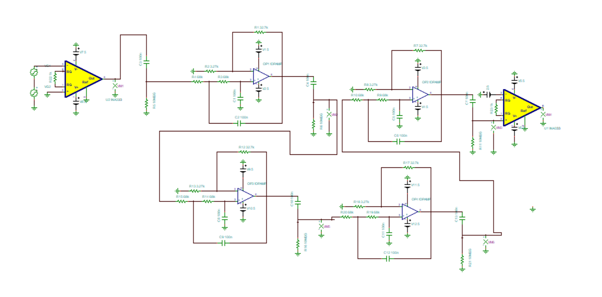
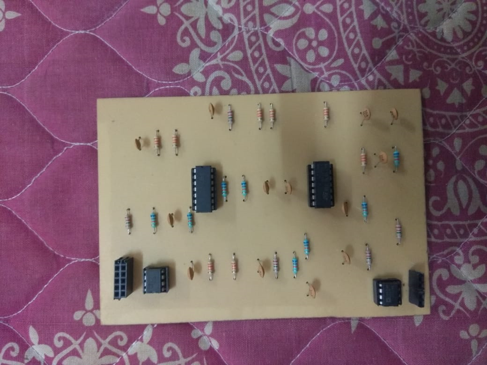
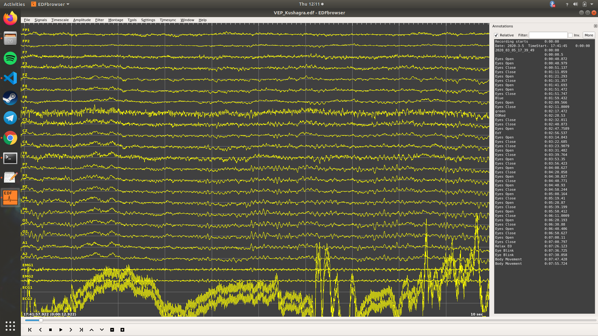

## Cerebro

A 4-DOF arm that can be controlled using Motor Imagery EEG signals and a haptic feed back system is implemented to materialize the exerted pressure.

The project proposes an approach towards EEG-driven position control of a robot arm by utilizing motor imagery, P300 waveform and Visually evoked Potential to align the robot arm with desired target position. The user produces motor imagery signals to control the motion of the arm. The P300 waveforms gives us sufficient data to detect whether we are performing any motion or even imagining doing so. This becomes even more accurate with C3, C4, PZ, FZ signals coming into picture. Taking these signals as features gives us appropriate information on the motion imagined by the user. This information can be used to control different parameters that are necessary for controlling the arm.

#### Progress:

##### Arm

◦Inverse kinematics equations
After doing a literature survey,the following paper was chosen for developing the inverse kinematics equation for the 4-DOF arm.
https://ieeexplore.ieee.org/document/7166008

◦ Simulation in processing

A hand model was developed using Processing. The inverse kinematics equations were solved and the angle was fed to the model to validate the equations.

◦ Simulation in Gazebo

The arm is simulated in gazebo and rviz by using the CADs designed by us as meshes. The actuation of the joints were controlled by changing the servo angles and the respective output is checked in the simulation.

◦ Assembly of hand with string mechanisms

The arm parts were assembled with two degrees of freedom in the base joint and one degree of freedom in the elbow joint with the hand attached to the end of the forearm link acting as an end effector.
Finger Actuation. The CAD model of a hand, which had its finger controlled using the string mechanism was obtained from the InMoov website. This model was given for 3d printing. The 3d printed parts were assembled along with the strings. To facilitate the movement of the fingers of robotic arm, the string mechanism was researched upon and found suitable.  This mechanism uses the constancy of the length of wire passing through the finger structure to acquire the desired movement of finger. As the constancy of length was involved, we needed wires which are non stretchable over time and use. Hence we chose fishing braid as the wire that runs through the fingers of our robotic hand. This mechanism required 2 fishing braid wires to run through a single finger and the length of the wires and hence finger movements were controlled using servo motor rotation.

##### Signal Acquisition

◦ Tina simulation of the circuit

Second order butterworth filter along with passive high pass filter was designed for the range of 5-20Hz for noise removal from the EEG. The output was then given to an instrumentation amplifier. This circuit was simulated in Tina before trying it out in Breadboard.

◦ Breadboard implementation

The above circuit was practically implemented in the bread board and was validated.

◦ PCB design

The same circuit was designed to make a PCB using Proteus software and printed for one channel.

◦ EEG acquisition with OpenBCI Board	

As the designed board was for one channel, and for our application we need four channel, Open BCI board was used.
Due to the high impedance of the electrodes used and the absence of abrasion gel for reducing the impedance due to dead cells, Motor imagery signals were not obtained properly.
Hence EOG signals were acquired and the data was serially communicate to Arduino that checks with threshold and gives the appropriate output.Open BCI GUI was used to program the board on air.

##### Haptic feedback

◦ Force sensors and Flex sensors
Ideated on interfacing force sensors and flex sensors on the robotic hand. Force sensors are used to measure the force experienced by the robotic arm and have necessary feedback through the pressure actuator in the user’s glove. Flex sensors are used to measure the movements of the finger and the position, which would be used as feedback signal for the positioning of finger. Force sensors and flex sensors were tested and their response to different forces and positioning were recorded.

◦ Compressor

Compressor was tested with PWM to give out variable pressure that is necessary for filling the diaphragm. This will make sure that the required force is felt by the wearer of the glove, when the force sensors picks up the sensor values. 

◦ Mould CAD design

The mould is a 1.8cm x 1cm x 0.4cm cuboid, designed in CAD and  3D printed. This is the Master mould which will be used for making the base of the balloon actuation mechanism that will will be attached to the fingers of the user.
        
◦ Testing 1 (Mould)

One trial of making the PDMS mould was conducted. The curing agent an PDMS were added in the ratio of 1:10 and mixed using stirrer for 5 minutes after which the mixture was degassed in vacuum chamber. This mixture was then transferred to the mould and cured in hot air oven at 80 degrees for 6 hours.  The test did not yield the desired results, a s the PDMS had not solidified and instead had leaked outside the mould. The reason for it i that the terminal groups of the PDMS except hydroxyl and vinyl do not solidify, which I came to know later after analysing the reason for failure.

##### Signal Classification
 
◦ CNN algorithm

A convolutional neural net is used to classify the signals     acquired from all the electrodes and classified for jaw clenching and blinking with decent accuracy.

◦ Acquired Dataset

EOG data was acquired from electrodes placed on the forehead. Differential outputs from 4 electrodes were taken with respect to ground and used as features for training the model.

◦ EOG signals

The EOG signals of 3 different people were obtained for different eye movements. The differences were clearly observable, though the range of values varied time to time and person to person. Therefore calibration and thresholding of the EOG signal was performed in python. The algorithm classifies the movement of eye to top/bottom/right/left.

